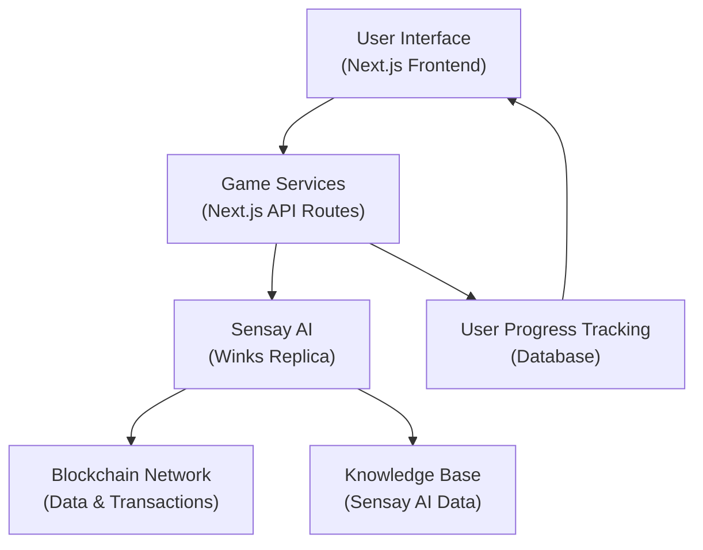

# QuestHub: Interactive Learning Platform with Sensay AI Integration

✨ **Overview**

**QuestHub** is an innovative and gamified learning platform designed to transform educational experiences. By seamlessly integrating **Sensay AI's Replica** technology and the **QuestBot API**, QuestHub offers a truly immersive and personalized journey through quizzes, riddles, and creative challenges. At its heart is **"Winks"**, a dynamic AI-powered blockchain educator and game guide, leveraging Sensay's capabilities to provide adaptive learning and engaging interactions.

> 📺 **[Click here to watch the QuestHub demo video on Google Drive](https://drive.google.com/file/d/1yS7uYKIacl91kJSbPoZ6DYuf91-uI4L5/view?usp=sharing)**  

---

🧠 **Sensay AI Integration & Replica Technology**

QuestHub’s intelligence is powered by **Sensay AI's Replica** engine, enabling the creation of **“Winks”** — your personal AI guide.

### Core Components

- **AI-Powered Guide (Winks):** A sophisticated Replica instance acting as a blockchain expert, game host, and educator.  
- **Contextual Awareness:** Maintains conversation history and game state for coherent, continuous learning.  
- **Adaptive Learning:** Dynamically adjusts challenge difficulty and feedback based on user performance.

### Replica Configuration (PowerShell)

```powershell
$replicaPayload = @{
    name = "QuestBot Host"
    shortDescription = "Knowledgeable host for QuestBot games"
    greeting = "Welcome to QuestBot! Your guide for exciting challenges."
    slug = "winks_v1"
    ownerID = $userId
    type = "character"
    tags = @("Education", "Web3", "Blockchain", "Games")
    llm = @{
        model = "claude-3-5-haiku-latest"
        memoryMode = "prompt-caching"
        systemMessage = "As Winks, provide engaging blockchain guidance, ask questions, and offer encouraging feedback. Maintain a friendly, helpful, and slightly playful tone. Never reveal answers directly; always guide the user to discover them."
    }
}
````

---

🎮 **Game Modules**

**API Endpoint**: [QuestHub Games](
https://github.com/Obiajulu-gif/questbot-endpoint)


| Module              | API Endpoint         | Key Features                                                             |
| ------------------- | -------------------- | ------------------------------------------------------------------------ |
| Quiz Engine         | `/api/quiz/question` | Adaptive questions, progress tracking, MCQ and fill-in-the-blank formats |
| Riddle System       | `/api/riddle`        | Multi-attempt logic puzzles, wordplay hints, escalating difficulty       |
| Creative Challenges | `/api/prompt`        | Open-ended tasks, PDF submissions, detailed AI feedback                  |
| Knowledge Boost     | `/api/fun-fact`      | Quick blockchain trivia and "Did you know?" facts in context             |

---

🛠️ **Technical Stack**

* **Frontend:** React.js (Next.js Framework)
* **Styling:** Tailwind CSS
* **State Management:** React Context API
* **AI Integration:** Sensay SDK + QuestBot API
* **Deployment:** Vercel

### Project Structure

```plaintext
QuestHub/
├── app/                  # Next.js routes and pages
├── components/           # UI components
├── contexts/             # Global state management
├── utils/                # Utility functions and API handlers
└── sensay-sdk/           # Sensay API integration layer
```

---

🚀 **Quick Start**

### Prerequisites

* Node.js (v18+)
* npm (v9+)
* Git

### Installation

```bash
git clone https://github.com/Obiajulu-gif/QuestHub.git
cd QuestHub
npm install --legacy-peer-deps
```

### Configuration

Create `.env.local` and add:

```env
SENSAY_API_KEY=your_api_key_here
NEXT_PUBLIC_SENSAY_API_KEY_SECRET=your_secret_key_here
```

### Initialize Replica

```powershell
powershell -ExecutionPolicy Bypass -File .\create-sensay-replica.ps1
```

### Run Locally

```bash
npm run dev
# Navigate to http://localhost:3000
```

---

🌐 **Deployment Architecture**



---

# 🔍 AI Copilot Features

Beyond just guiding, Winks acts as an intelligent AI Copilot, providing dynamic assistance and feedback.

### Contextual Assistance:
Winks offers tailored guidance based on the active game module, ensuring relevant and helpful prompts:

* **Quiz:** *"Think carefully — sometimes the best answer isn’t obvious."*
* **Riddles:** *"Look for double meanings or clever wordplay!"*
* **Creative:** *"Structure your response clearly: intro, main idea, conclusion."*

### Feedback System

```js
function generateFeedback(attempt) {
    const accuracy = calculateAccuracy(attempt);
    const complexity = assessComplexity(attempt);

    let feedbackMessage = `Great effort! Your solution shows **${accuracy}% alignment** with core concepts. `;

    if (accuracy < 50) {
        feedbackMessage += "Let's review the basics together. What part felt most challenging?";
    } else if (accuracy < 80) {
        feedbackMessage += `You're almost there! Try ${complexity > 0.7 ? 'simplifying' : 'expanding on'} key areas to refine your understanding.`;
    } else {
        feedbackMessage += "Excellent work! You've grasped the concept beautifully. Ready for the next challenge?";
    }
    return feedbackMessage;
}
```

---

## 📌 **Key Integration Points**

Seamless integration with Sensay AI and other services is achieved through carefully designed interaction points.

1. Context Propagation:
Enriching API requests with user-specific metadata allows Winks to provide highly personalized interactions.

```js
function enhanceContext(request) {
    const userLevel = getLevel(request.userId);
    const lastActivity = getLastSession(request.userId);
    const currentStreak = getStreak(request.userId);

    return {
        ...request,
        metadata: {
            userLevel,
            lastActivity,
            currentStreak
        }
    };
}
```

---

🚧 **Future Roadmap**

* [ ] **User-Generated Replica Templates**
* [ ] **Cross-Platform Progress Sync**
* [ ] **AI Challenge Creator Toolkit**
* [ ] **Multi-Language Support (35+ languages)**

### Upcoming Features

* Personal replica branding
* Custom knowledge domain uploads
* Leaderboard integration
* Multi-AI replica collaboration

---

🤝 **Contributing**

1. Fork the repo
2. Create a branch: `git checkout -b feature/your-feature-name`
3. Commit: `git commit -m 'feat: Add feature'`
4. Push: `git push origin feature/your-feature-name`
5. Open a Pull Request 🎉

---

📄 **License & Attribution**

Licensed under **MIT**.
Uses Sensay AI.

---

📧 **Contact**

* GitHub Issues: [QuestHub on GitHub](https://github.com/Obiajulu-gif/QuestHub/issues)
